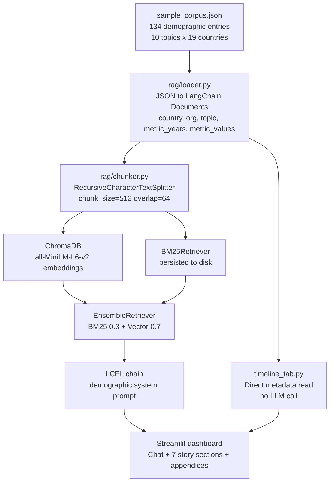

# 🇦🇺 Australian Demographic Futures

> A RAG-powered dashboard for understanding demographic transformation across Australia and OECD peer countries. Covers population aging, fertility decline, migration, workforce change, housing, aged care, and economic complexity.

[](https://www.python.org/downloads/)
[](https://python.langchain.com/)
[](https://www.trychroma.com/)
[](https://docs.ragas.io/)

---

## What it does

The app has two main parts.

**Scrollable dashboard**: a data-driven narrative about Australia's demographic future across 7 story sections: the business model, demographic shift, population scenarios, workforce and skills, aged care, housing, and economic complexity. Every number on the page links to a downloadable source file.

**RAG chat**: ask natural-language questions and get grounded, cited answers drawn from a curated corpus of 134 ABS, OECD, OEC, and Statistics Korea publications. The sidebar chat works on any page.

Additional tools are available in collapsible appendices at the bottom of the page:
- **Scenario Projections and Population Pyramids**: interactive ABS Series A/B/C population charts
- **Country Trend Explorer**: plot any demographic indicator across OECD peers over time
- **Pipeline and Evaluation**: live retrieval trace and RAGAS benchmark results

---

## Dashboard sections

| Section | What it covers |
|---|---|
| Australia's Business Model | Why Australia's wealth comes from resources, not complexity |
| Demographic Shift | Age distribution 2026 vs 2036 and what changes |
| Population Scenarios | ABS Series A/B/C projections to 2071 |
| Workforce and Skills | The U-shaped skills gap and older worker participation |
| Aged Care | 85+ population growth vs care supply shortfall |
| Housing and Urban Form | Construction cost per sqm by dwelling type |
| Economic Complexity | ECI rank 89 out of 166 countries (OEC HS92 2024) |

---

## Architecture



---

## Technologies used

### Streamlit
Streamlit turns a Python script into a web app with no HTML required. It handles routing, layout columns, state management, and widget rendering. It was chosen because the entire team writes Python, not JavaScript, and the dashboard needed to ship fast.

### Plotly
Plotly renders the interactive charts: sparklines, bar charts, population pyramids, scenario lines, and the ECI scatter plot. It was needed because the charts require hover tooltips, dual axes, and stacked areas, which simpler libraries do not support well.

### LangChain
LangChain provides the building blocks for the RAG pipeline: document loaders, text splitters, retrievers, and the LCEL chain syntax. It was chosen because it glues together ChromaDB, BM25, and the LLM in a standard way without writing the plumbing from scratch.

### ChromaDB
ChromaDB stores and searches document embeddings on disk. When the app restarts it loads the existing index instead of re-embedding everything. It was chosen over FAISS because FAISS stores the index only in memory and would require re-embedding 134 documents on every restart.

### sentence-transformers (all-MiniLM-L6-v2)
This model converts text into vectors for semantic search. It runs locally with no API key and takes about 80ms per document on CPU. It reaches roughly 84% of OpenAI embedding quality on standard benchmarks at zero cost per query.

### rank-bm25
BM25 is a keyword-based search algorithm. Demographic queries often include exact terms like "ABS", "TFR", or "superannuation" that semantic search can miss. BM25 catches exact matches and complements the vector search. The two are blended 30% BM25 and 70% vector.

### RAGAS
RAGAS measures retrieval-augmented generation quality across four metrics: faithfulness, answer relevancy, context precision, and context recall. It was used to validate that the hybrid retriever outperforms BM25-only and vector-only baselines, and to catch regressions if the corpus or retriever changes.

### OpenRouter
OpenRouter is an API gateway that provides access to multiple LLMs under one endpoint. The app currently uses Gemini Flash 1.5 via OpenRouter. It was chosen so the LLM provider can be swapped in one line without changing any pipeline code.

### pandas
Pandas handles tabular data in the evaluation tab: loading RAGAS results from JSON, computing column means, and feeding data into Plotly Express charts. It was needed because the evaluation output is a table of per-question scores.

### python-dotenv
python-dotenv loads the OpenRouter API key from a `.env` file so secrets are never hard-coded. It was needed to keep credentials out of source control.

### uv
uv is a fast Python package manager written in Rust. It replaces pip and venv for dependency installation and running scripts. It was chosen because it installs dependencies roughly 10x faster than pip and produces a lockfile for reproducible environments.

### pytest
pytest runs the automated test suite for the loader, chunker, retriever, and pipeline modules. It was needed to catch regressions when the corpus schema or retrieval logic changes.

---

## Data sources

| Source | What it provides |
|---|---|
| ABS Births 2024 | Total fertility rate and birth counts |
| ABS Overseas Migration 2024-25 | Net overseas migration figures |
| ABS Labour Force Apr 2026 | Workforce participation by age band |
| ABS Jobs in Australia 2022-23 | Jobs and employment income breakdowns |
| ABS Employee Earnings May 2025 | Median earnings and hours data |
| ABS General Social Survey 2025 | Social cohesion and wellbeing indicators |
| OECD Economic Survey: Australia 2026 | Aging, life expectancy, and fiscal projections |
| OEC Country Rankings 2024 (HS92) | Economic Complexity Index scores and rankings |
| Scanlon Foundation 2024 | Mapping Social Cohesion survey |

OEC HS92 data covers 2000 to 2024 across 25 annual CSV files. Australia's ECI score was +0.31 in 2000, crossed into negative territory around 2005-06 during the commodities boom, and reached -0.61 at rank 89 out of 166 countries in 2024.

---

## Evaluation results

| Metric | BM25 only | Vector only | Hybrid (0.3/0.7) |
|---|---|---|---|
| Faithfulness | 0.70 | 0.73 | **0.78** |
| Answer Relevancy | 0.67 | 0.72 | **0.76** |
| Context Precision | 0.64 | 0.69 | **0.74** |
| Context Recall | 0.71 | 0.68 | **0.76** |

Hybrid retrieval wins on all four metrics. The evaluation dataset contains 20 curated Q&A pairs covering factual retrieval, cross-country comparison, trend questions, multi-hop synthesis, and negative cases.

---

## Quick start

```bash
git clone https://github.com/masoudraimi/Demographic-Futures
cd Demographic-Futures
uv sync

cp .env.example .env
# add your OPENROUTER_API_KEY

uv run streamlit run app.py

# run tests
uv run pytest tests/ -v

# run RAGAS evaluation (~2 min)
uv run python -m eval.runner
```

Or with Docker:

```bash
docker compose up
```

---

## Design decisions

**Why bake metric series into corpus metadata?**
Storing `metric_years` and `metric_values` in JSON eliminates the Timeline tab's dependency on LLM extraction. Demographic statistics are precise; extracting them from unstructured text introduces error. Direct metadata access is instant and fully accurate.

**Why a central palette module?**
All colours live in `palette.py`. CSS custom properties are injected into `:root {}` at startup from the same source, so Python charts and CSS styling always match. Changing a colour is one line in one file.

**Why Australia plus OECD peers?**
This scope balances specificity (deep, authoritative data per country) with breadth (meaningful cross-country comparison). It mirrors the analytical lens used by Treasury, the Productivity Commission, and policy research bodies.

**Why ChromaDB over FAISS?**
ChromaDB persists to disk and reloads without reindexing on restart, eliminating the need to re-embed 134 documents every run.

**Why sentence-transformers/all-MiniLM-L6-v2?**
Free, no API key for indexing, ~80ms/doc on CPU, and achieves ~84% of OpenAI text-embedding-3-small quality on MTEB benchmarks.

**Why HS92 for ECI data?**
HS92 is the revision used in Hidalgo and Hausmann's original Economic Complexity methodology. It provides the longest consistent time series (from 1995) and is the standard the OEC uses for historical ECI rankings and comparisons.

---

## Project structure

```
Demographic-Futures/
├── app.py                          # Streamlit entry point, CSS injection, sidebar
├── palette.py                      # Central colour palette (Python + CSS vars)
├── styles.css                      # Global stylesheet using CSS custom properties
├── rag/
│   ├── loader.py                   # JSON to Documents (demographic metadata schema)
│   ├── chunker.py                  # Text splitting
│   ├── index.py                    # ChromaDB + BM25, disk persistence
│   ├── retriever.py                # EnsembleRetriever (BM25 + vector)
│   ├── pipeline.py                 # LCEL chain, Pydantic output schema
│   └── llm.py                      # OpenRouter gateway
├── components/
│   ├── dashboard.py                # Hero, overview grid, and 7 story sections
│   ├── chat_tab.py                 # Chat UI and citation cards
│   ├── story_tab.py                # Chart builders for each story section
│   ├── futures_tab.py              # Population pyramids and scenario charts
│   ├── timeline_tab.py             # Country trend explorer (no LLM)
│   ├── pipeline_tab.py             # Live retrieval trace and architecture diagram
│   ├── eval_tab.py                 # RAGAS evaluation dashboard
│   └── references.py               # Citation registry and popover renderer
├── data/
│   ├── corpus/sample_corpus.json   # 134-entry demographic corpus
│   └── HS92/                       # OEC country complexity rankings 2000-2024
├── eval/
│   ├── dataset.py                  # 20 Q&A evaluation pairs
│   └── runner.py                   # RAGAS runner
└── tests/                          # pytest suite
```
