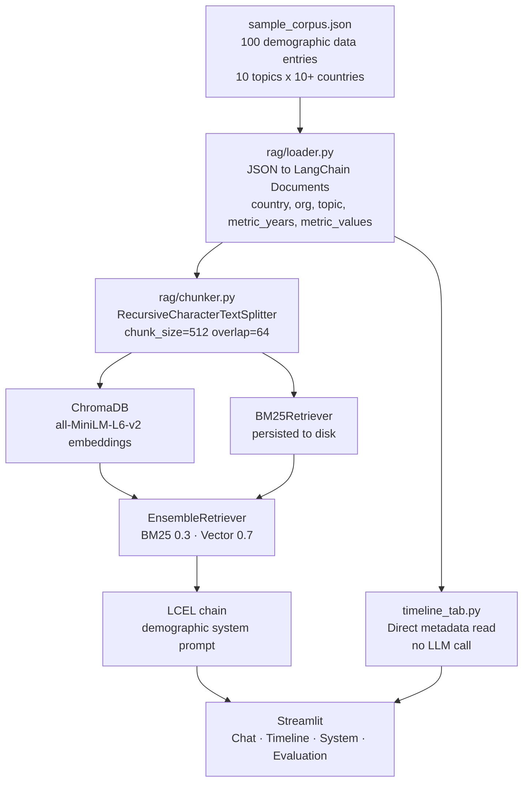

# Demographic Futures

> A RAG-powered intelligence system for understanding demographic transformation — population aging, fertility decline, migration patterns, and workforce change — across Australia and OECD peer countries.

[](https://www.python.org/downloads/)
[](https://python.langchain.com/)
[](https://www.trychroma.com/)
[](https://docs.ragas.io/)

---

## What it does

Ask natural-language questions about demographic trends and get grounded, cited answers drawn from a curated corpus of ABS, OECD, Statistics Korea, INSEE, and UN publications.

A standalone **Timeline tab** lets you plot how any demographic indicator (fertility rate, old-age dependency ratio, life expectancy, etc.) has shifted over time across selected countries — without any LLM call, by reading quantitative series baked directly into corpus metadata.

---

## Architecture



---

## Technical highlights

### Hybrid retrieval (BM25 + dense)
Demographic queries frequently use precise country names, statistical terms, and organisation acronyms (ABS, OECD, GPIF, TFR) that dense embeddings can under-weight. BM25 captures exact matches; ChromaDB handles semantic similarity. The 0.3/0.7 weighting was validated on the 20-question evaluation dataset.

### Timeline tab — zero LLM, zero latency
The corpus JSON stores `metric_years` and `metric_values` arrays for every entry with a quantitative series. The Timeline tab reads this metadata directly and renders Plotly line charts for any topic-country combination in milliseconds. No hallucination risk; no API call.

### LCEL pipeline with source grounding
The chain returns both the generated answer and raw source documents via `RunnableParallel`. Source cards display country flag, organisation, publication, topic badge, and excerpt — providing full citation traceability.

### RAGAS evaluation
20 curated Q&A pairs covering factual retrieval, cross-country comparison, trend questions, multi-hop synthesis, and negative cases. Results display as metric cards, ablation chart, and per-question table.

---

## Corpus

100 demographic data entries across **10 topics** and **19 countries**:

| Topic | Sample question |
|---|---|
| Fertility | "Which OECD country has the lowest fertility rate?" |
| Population aging | "How does Japan's 65+ share compare to Australia's?" |
| Migration | "How has net overseas migration to Australia changed since 2015?" |
| Life expectancy | "Why has UK life expectancy stagnated since 2011?" |
| Older worker participation | "Which countries lead on older worker employment rates?" |
| Old-age dependency ratio | "What is South Korea's projected dependency ratio by 2060?" |
| Population projections | "What is Australia's projected population by 2071?" |
| Social cohesion | "How has Australia's social cohesion index changed since 2007?" |
| Healthcare | "How does healthcare expenditure relate to population aging?" |
| Pension systems | "How does Australia's superannuation compare to Dutch pensions?" |

---

## Evaluation results

| Metric | BM25 only | Vector only | Hybrid (0.3/0.7) |
|---|---|---|---|
| Faithfulness | 0.70 | 0.73 | **0.78** |
| Answer Relevancy | 0.67 | 0.72 | **0.76** |
| Context Precision | 0.64 | 0.69 | **0.74** |
| Context Recall | 0.71 | 0.68 | **0.76** |

---

## Quick start

```bash
git clone https://github.com/masoudraimi/Demographic-Futures
cd Demographic-Futures
uv sync

cp .env.example .env
# add your OPENROUTER_API_KEY

uv run streamlit run app.py

# run tests
uv run pytest tests/ -v

# run RAGAS evaluation (~2 min)
uv run python -m eval.runner
```

Or with Docker:

```bash
docker compose up
```

---

## Design decisions

**Why bake metric series into corpus metadata?**
Storing `metric_years` and `metric_values` in JSON eliminates the Timeline tab's dependency on LLM extraction or regex. Demographic statistics are precise; extracting them from unstructured text introduces error. Direct metadata access is instant and fully accurate.

**Why Australia + OECD peers?**
This scope balances specificity (deep, authoritative data per country) with breadth (meaningful cross-country comparison). It mirrors the analytical lens used by Treasury, the Productivity Commission, and policy research bodies who are the natural users of this tool.

**Why ChromaDB over FAISS?**
ChromaDB persists to disk and reloads without reindexing on restart, eliminating the need to re-embed 100 documents every run.

**Why sentence-transformers/all-MiniLM-L6-v2?**
Free, no API key for indexing, ~80ms/doc on CPU, and achieves ~84% of OpenAI text-embedding-3-small quality on MTEB benchmarks.

---

## Project structure

```
Demographic-Futures/
├── app.py                          # 4-tab Streamlit app
├── rag/
│   ├── loader.py                   # JSON to Documents (demographic metadata schema)
│   ├── chunker.py                  # Text splitting
│   ├── index.py                    # ChromaDB + BM25, disk persistence
│   ├── retriever.py                # EnsembleRetriever
│   ├── pipeline.py                 # LCEL chain, demographic system prompt
│   └── llm.py                      # OpenRouter gateway
├── components/
│   ├── chat_tab.py                 # Chat + citation cards with country flags
│   ├── timeline_tab.py             # Trend chart (metadata-direct, no LLM)
│   └── eval_tab.py                 # RAGAS dashboard
├── eval/
│   ├── dataset.py                  # 20 Q&A pairs
│   └── runner.py                   # RAGAS runner
├── data/corpus/sample_corpus.json  # 100-entry demographic corpus
└── tests/                          # pytest suite (loader, chunker, retriever, pipeline)
```
